## R.E.P.E.A.T.

#### Recursive Eternity Pilot Education And Tracking

Mid-term Team Project for Skill Distillery, April 2024.

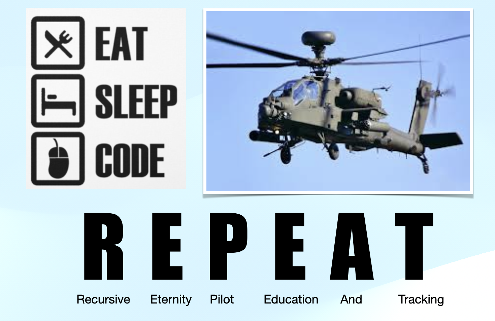

#### Description

- (R)ecursive (E)ternity (P)ilot (E)ducation (A)nd (T)racking

- Recursive Eternity is the team name given to us when we were assigned this project. Using those letters along with the overal core need for this program, we came up with the name based on the age old coding philosophy - Eat, Sleep, Code, and R.E.P.E.A.T.

- EPIC: Military pilots are tasked with maintaining a constant state of readiness. This includes their academic, medical and clearance certifications of good standing as well as the certification that they are up to date with required flight training/experience. By logging each flight a pilot completes along with the details of the training/practice that occurred on these flights, the sum of all experiences can be compared to the total number of time requirements that are determined necessary. When the pilot meets or exceeds these requirements, they are regarded as combat ready and sufficiently trained to for the specific types of aircrafts the pilot is tasked with operating.

- INITIATIVE: Create a web based, mobile friendly website that allows for the tracking of pilot qualifications for various aircraft. The site should be able to easily identify any shortcoming in pilot experience needed to be regarded as fully qualified/combat ready.

#### Team members and roles:

- Bryan Bradley (SCRUM Master, DBA, Developer)
- Sheldon Pasciak (Developer, Repo Owner)

#### Overview

- A pilot user of the system logs their flight details.
- The application sums the total flight experiences to determine if more training is needed.

#### Description

- The website allows users to register and maintain their information using Create, Read, Update and Delete functionality.
- Multiple roles exist to use/maintain the data. ( pilot, clerk, commander, admin )

#### Technologies Used

    - JAVA
    - Eclipse
    - Git/GitHub
    - MySQL
    - Sublime Text Editor
    - Zsh
    - JPA
    - Spring Boot
    - HTML/CSS
    - JSTL
    - Bootstrap 5
    - Trello

#### Lessons Learned

    - Attention to detail, read and re-read requirements.
    - Make it work, then make it look good.
    - Focus on the requirements, then stretch the goals!
    - Remember to update Tests according to seeded database.
    - Planning with a wiring diagram and needed models was helpful.
    - Trello board kept us on target.
    - Good structuring for DAO interfaces and implementations.
    - Good structuring for .jsp views in folder structures for roles.
    - Implementation of both frontend and backend security.

#### Implementation

- This is a JAVA Spring Boot full stack project.
- All entity classes are in a JAVA Persistence Application and have JUnit tests completed.

#### The approved MySQL Entity Relationship Diagram is as follows.

#### Application screenshots that demo the full functionality of the site.

## HOME PAGE

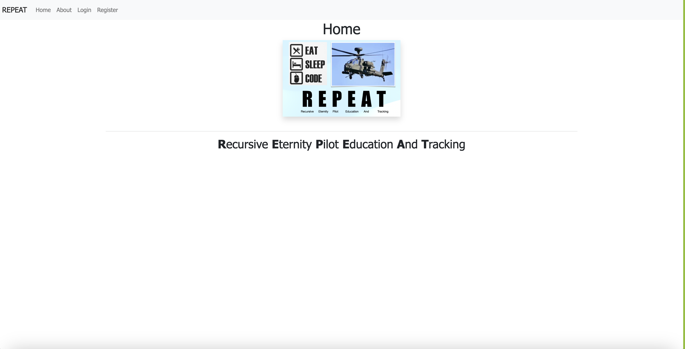

## ABOUT PAGE

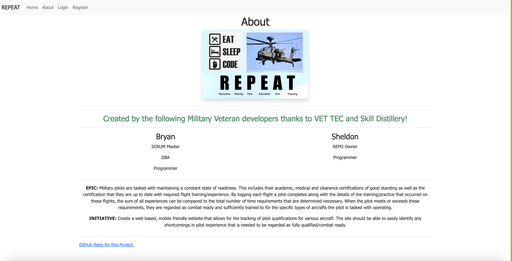

## REGISTER PAGE

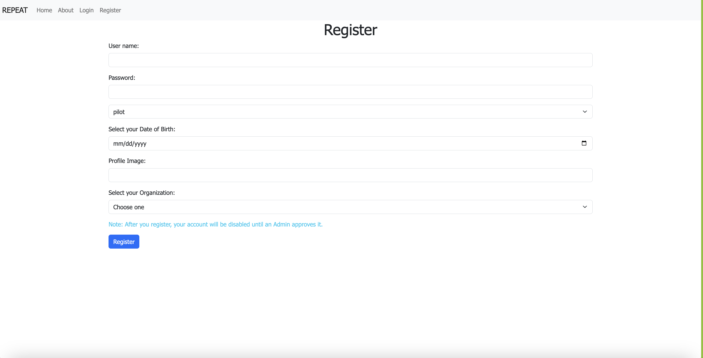

## PROFILE PAGE (SHOWN AFTER LOGIN)

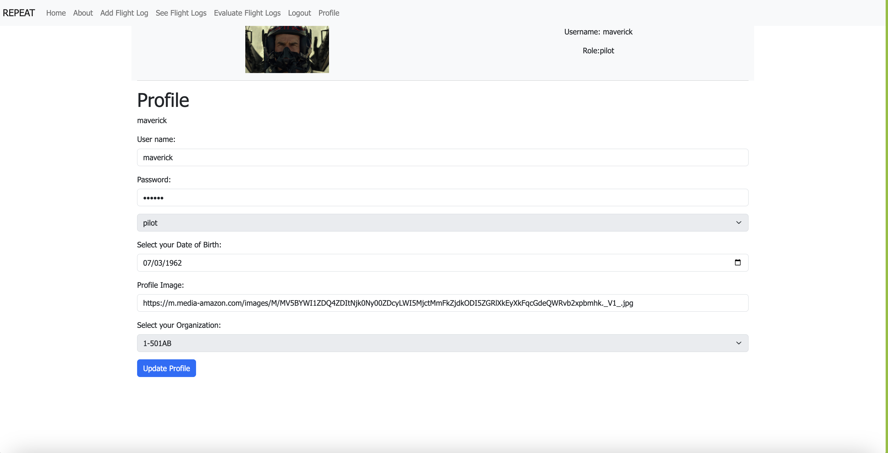

## ADD FLIGHT LOG (PILOT LOG ENTRY)

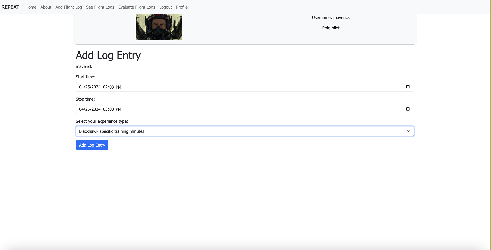

## EVALUATE FLIGHT LOGS (EXPERIENCE TYPE REQUIREMENTS)

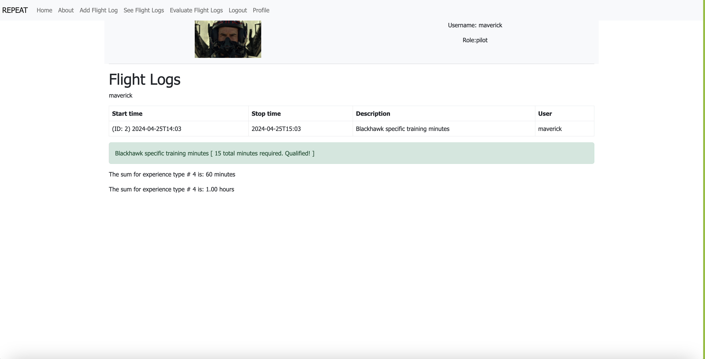

## ADMIN USER'S VIEW ( ADMIN ENABLE/DISABLE USERS )

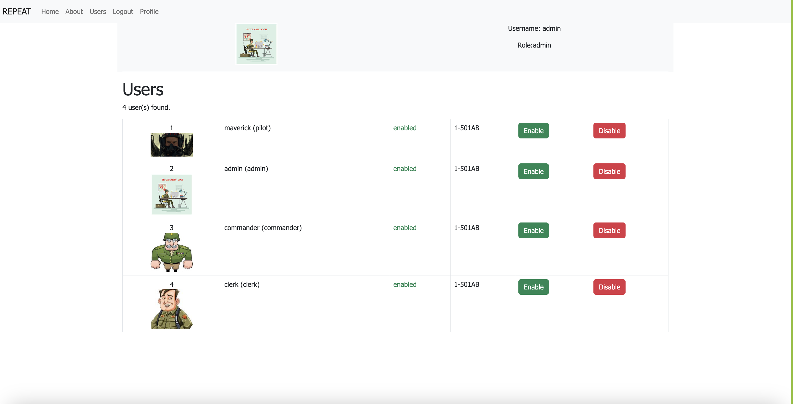

## CLERK MAINTAINS ( PILOT CERTIFICATIONS )

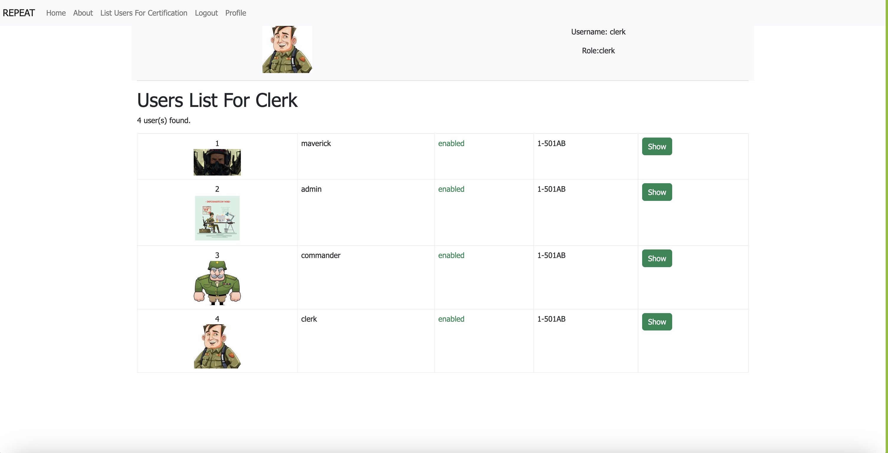

## CLERK MAINTAINS ( INDIVIDUAL ELEMENTS OF CERTIFICATION FOR USERS )

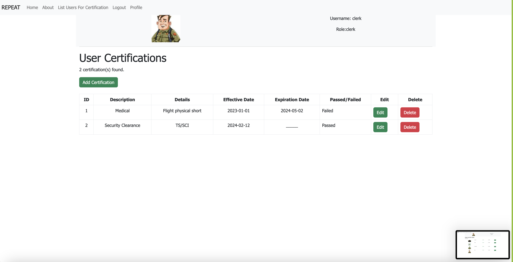

#### Demo username and password for use of the deployed demo site:

#### Pilot Role

- username: maverick
- password: topgun

#### Admin Role

- username: admin
- password: admin

[About The Developers-Sheldon](https://www.linkedin.com/in/sheldonpasciak/)

[About The Developers-Bryan](https://www.linkedin.com/in/bryan-r-bradley/)

# AFTER ACTION REVIEW / WASH-UP

## The following screenshots are posted to identify a few small changes that would improve the current core-functionality of the app as it is. These three ideas are simply added here to honestly identify what is known about small important changes that should be included as improvements before future features are added.

 

 

## Showing Pilot Name/Details on the Clerk's add/edit pages would be helpful because while editing/adding user certifications it would be clear which user (pilot) you are adding/editing certifications for.

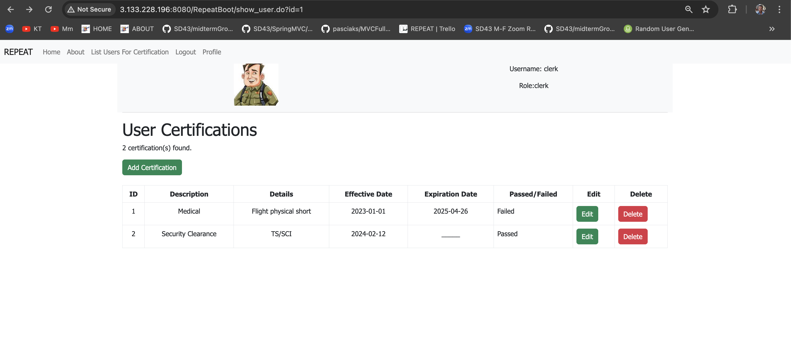

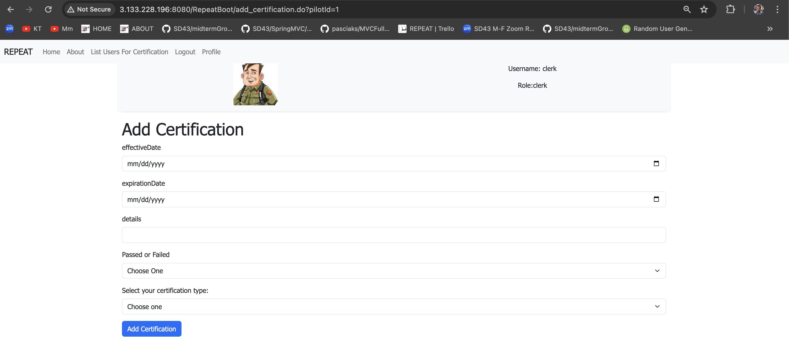

 

 

## The current method to sum pilot log entries for passing to the view that shows the comaprison of pilot log experiences to experience requirements needs improved.

- The implemented quick and dirty solution simply stores the sums collected by the database id for the experience type.
- This is flawed because any database id's > 999 would fail.
- This is flawed because it passes the controller method sums of experience by type in an array of int[999] to the view.
- Better would be to create a separate list of a new entity that has it's type ID and SUM.
- Possibly even better would be JPQL/SQL equivalents to sum, group and create a datastructure of rows that would be shown by using a complex query.

 

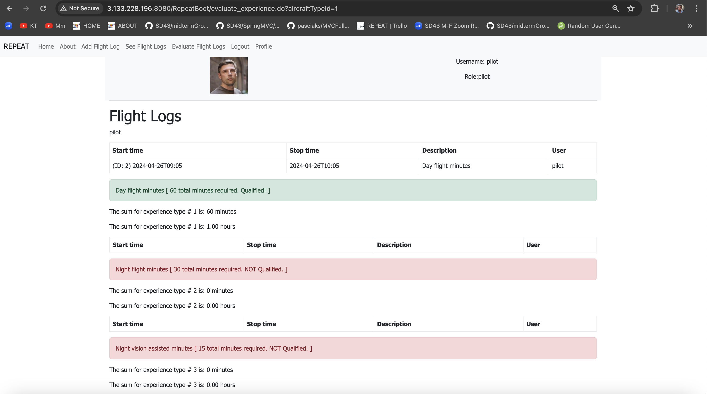

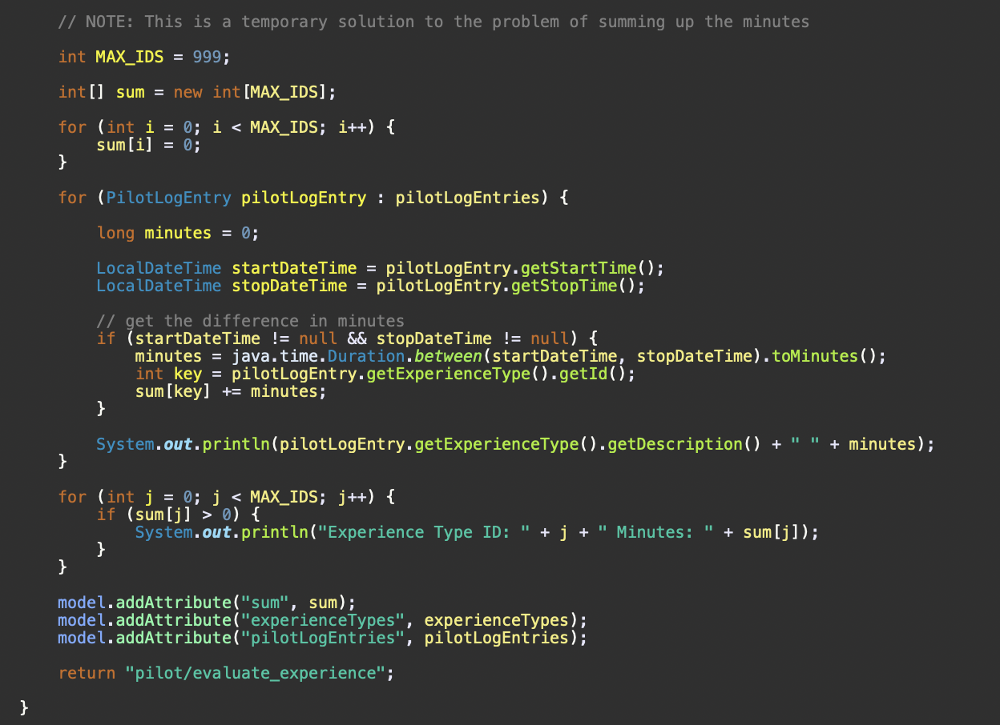
