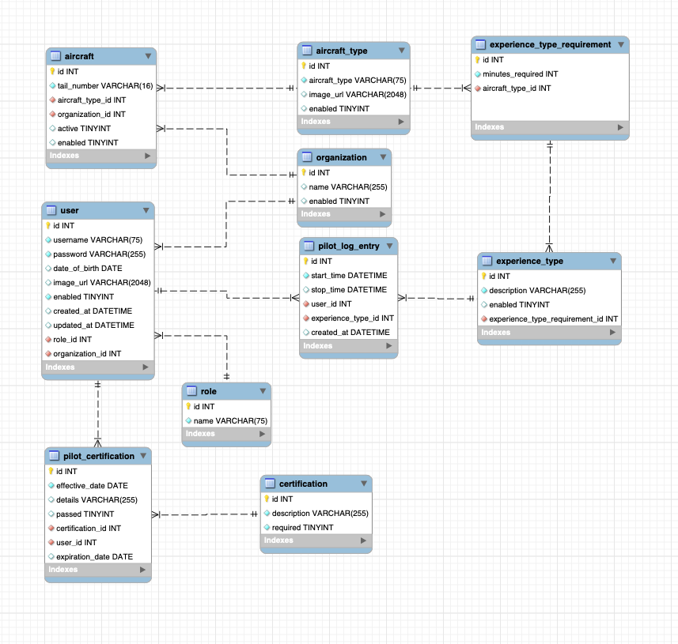

# MVCFullStackMidtermProject

R.E.P.E.A.T. -- Mid-term Team Project for Skill Distillery.

#### Description

- Recursive Eternity Pilot Education And Tracking

- EPIC: Military pilots are tasked with maintaining a constant state of readiness. This includes their academic, medical and clearance certifications of good standing as well as the certification that they are up to date with required flight training/experience. By logging each flight a pilot completes along with the details of the training/practice that occurred on these flights, the sum of all experiences can be compared to the total number of time requirements that are determined necessary. When the pilot meets or exceeds these requirements, they are regarded as combat ready and sufficiently trained to for the specific types of aircrafts the pilot is tasked with operating.

- INITIATIVE: Create a web based, mobile friendly website that allows for the tracking of pilot qualifications for various aircraft. The site should be able to easily identify any shortcoming in pilot experience needed to be regarded as fully qualified/combat ready.

#### Team members and roles:

Bryan Bradley (SCRUM Master, DBA, Developer)
Sheldon Pasciak (Developer, Repo Owner)

#### Overview
- A pilot user of the system logs their flight details.
- The application sums the total flight experiences to determine if more training is needed.

#### Description
- The website allows users to register and maintain their information using Create, Read, Update and Delete functionality.
- Multiple roles exist to use/maintain the data. ( pilot, clerk, commander, admin )

#### Technologies Used

    - JAVA
    - Eclipse
    - Git/GitHub
    - MySQL
    - Sublime Text Editor
    - Zsh
    - JPA
    - Spring Boot
    - HTML/CSS
    - JSTL
    - Bootstrap 5
    - Trello

#### Lessons Learned

    - Attention to detail, read and re-read requirements.
    - Make it work, then make it look good.
    - Focus on the requirements, then stretch the goals!
    - Remember to update Tests according to seeded database.
    - Planning with a wiring diagram and needed models was helpful.
    - Trello board kept us on target.
    - Good structuring for DAO interfaces and implementations.
    - Good structuring for .jsp views in folder structures for roles.
    - Implementation of both frontend and backend security.

#### Implementation
- This is a JAVA Spring Boot full stack project.
- All entity classes are in a JAVA Persistence Application and have JUnit tests completed.

#### The approved MySQL Entity Relationship Diagram is as follows.

[About The Developers-Sheldon](https://www.linkedin.com/in/sheldonpasciak/)

[About The Developers-Bryan](https://www.linkedin.com/in/bryan-r-bradley/)

